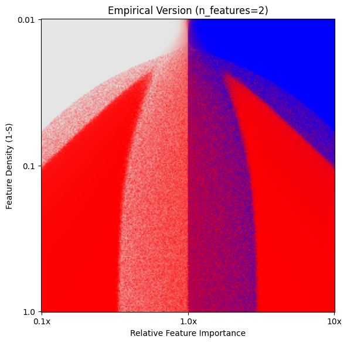
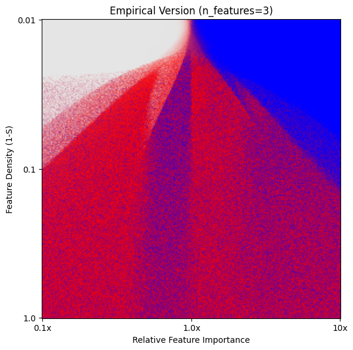

# Repro Superposition

Anthropic publishes research aimed at understanding the internals of LLMs in the [Transformer Circuits Thread](https://transformer-circuits.pub/).
This repository contains code to reproduce the experiments from Section 3, [Superposition as a Phase Change](https://transformer-circuits.pub/2022/toy_model/index.html#phase-change), of [Toy Models of Superposition](https://transformer-circuits.pub/2022/toy_model/).

## Original Repositories

This implementation is based on the official repository [toy-models-of-superposition](https://github.com/anthropics/toy-models-of-superposition) and the Section 3 repository [superposition](https://github.com/wattenberg/superposition); we thank the Anthropic team and Martin Wattenberg for generously open-sourcing their work.

## Setup

```bash
$ uv sync --locked
```

## Usage

Run [empirical_version.py](empirical_version.py) to train separately for each `n_features`.
In the original paper, `n_features` was set to 2 or 3.

### Single GPU or CPU

```bash
$ uv run empirical_version.py --n_features 2
$ uv run empirical_version.py --n_features 3
```

### Multi GPU

```bash
$ CUDA_VISIBLE_DEVICES=0,1,2,3
$ uv run torchrun --nproc_per_node=4 empirical_version.py --n_features 2
$ uv run torchrun --nproc_per_node=4 empirical_version.py --n_features 3
```

CSV files are written under the `output/` directory for each value of `n_features`.
Because the above commands can take a long time, sample results are already stored in the [output/](output/) directory.

## Comparing empirical and theoretical versions

Open [Superposition_as_a_Phase_Change.ipynb](Superposition_as_a_Phase_Change.ipynb) and run the cells.

In short, the current implementation does not perfectly reproduce the results from the original paper.
Below are results for `n_features = 2` and `n_features = 3`.

<table>
  <tr>
    <th style="width: 50%;">n_features = 2</th>
    <th style="width: 50%;">n_features = 3</th>
  </tr>
  <tr>
    <td></td>
    <td></td>
  </tr>
</table>

This may be due to differences in training hyperparameters such as learning rate or number of training steps.

However, [empirical_version.py](empirical_version.py) includes parallelization to make experimentation more efficient, and [Superposition_as_a_Phase_Change.ipynb](Superposition_as_a_Phase_Change.ipynb) both partially reproduces the original paper’s results and provides a more detailed theoretical explanation, so this repository may still be useful.

If you obtain better results or notice anything to fix, feel free to open an issue.
